# Tutorial de Kedro con Titanic

Tutorial de [Kedro](https://kedro.org/) con el dataset del Titanic y XGBoost 1.5.8.

## Estructura de pipelines




| Pipeline | Responsabilidad |
|---|---|
| `data_ingestion` | Carga y validación de `train.csv` y `test.csv` |
| `preprocessing` | Limpieza, imputación y encoding (sin leakage) |
| `feature_engineering` | `FamilySize`, `IsAlone`, `Title`; selección de features |
| `model_training` | Split estratificado, XGBoost fit con early stopping, métricas |
| `inference` | Predicciones sobre test → `submission.csv` |

## Requisitos

- Python `>=3.10,<3.12`
- [uv](https://github.com/astral-sh/uv)

## Instalación

```bash
# Clonar y entrar al proyecto
git clone <repo>
cd titanic-kedro

# Crear entorno virtual e instalar dependencias
uv venv
source .venv/bin/activate  # Linux/macOS
# .venv\Scripts\activate   # Windows

uv sync --extra dev
```

## Datos

Descarga los datos desde [Kaggle Titanic](https://www.kaggle.com/c/titanic/data)
y colócalos en:

```
data/01_raw/train.csv
data/01_raw/test.csv
```

O con la API de Kaggle:

```bash
kaggle competitions download -c titanic -p data/01_raw/
unzip data/01_raw/titanic.zip -d data/01_raw/
```

## Ejecución

```bash
# Pipeline completo
uv run kedro run

# Pipeline individual
uv run kedro run --pipeline data_ingestion
uv run kedro run --pipeline preprocessing
uv run kedro run --pipeline feature_engineering
uv run kedro run --pipeline model_training
uv run kedro run --pipeline inference

# Solo nodos con cierto tag
uv run kedro run --tags train
uv run kedro run --tags evaluation

# Ver el grafo de dependencias
uv run kedro viz
```

## Outputs

| Archivo | Descripción |
|---|---|
| `data/05_models/xgboost_model.pkl` | Modelo entrenado |
| `data/07_reporting/metrics.json` | Accuracy, F1, ROC-AUC sobre validación |
| `data/07_reporting/submission.csv` | Predicciones en formato Kaggle |

## Parámetros

Todos los hiperparámetros y configuraciones están en `conf/base/parameters.yml`.
Para sobreescribir sin modificar el archivo base:

```bash
uv run kedro run --params "model_training.xgboost.max_depth=6,model_training.xgboost.n_estimators=500"
```

## Tests

```bash
uv run pytest
uv run pytest --cov=src --cov-report=html
```