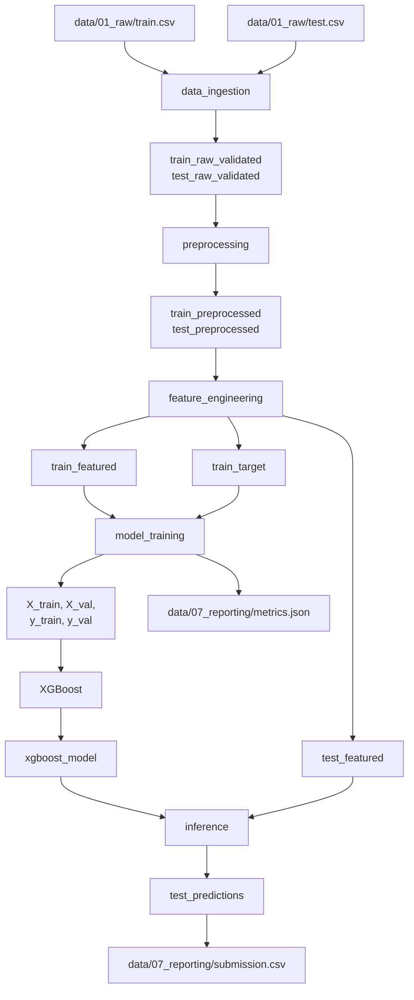

# Pipelines Y Flujo

## Panorama general

El proyecto completo está dividido en cinco pipelines. Cada uno resuelve una etapa distinta del trabajo y consume salidas producidas por la etapa anterior.

La gran ventaja de esta división es que el flujo queda explícito y se puede correr por partes.

## Diagrama end-to-end



## Cómo leer este flujo

La lógica general es esta:

1. Se cargan y validan los archivos crudos.
2. Se limpia `train` y `test` por separado.
3. Se crean variables derivadas.
4. En train se separan features y target.
5. Se entrena el modelo usando un subconjunto de validación.
6. Ese modelo se aplica sobre test.
7. Se genera un archivo final con el formato esperado por Kaggle.

## Pipeline por pipeline

### 1. `data_ingestion`

Su objetivo no es transformar, sino validar y registrar información útil.

Entradas:

- `train_raw`
- `test_raw`

Salidas:

- `train_raw_validated`
- `test_raw_validated`

Qué hace:

- verifica que existan las columnas mínimas esperadas,
- comprueba que `Survived` en train solo contenga `0` y `1`,
- reporta valores faltantes,
- y devuelve el mismo DataFrame si la validación pasa.

La idea es detectar problemas temprano, antes de que fallen etapas posteriores con errores más difíciles de interpretar.

### 2. `preprocessing`

Este pipeline toma los datos validados y los deja listos para ingeniería de variables.

Entradas:

- `train_raw_validated`
- `test_raw_validated`
- parámetros de preprocesamiento

Salidas:

- `train_preprocessed`
- `test_preprocessed`

Orden real de transformación:

1. extraer `Title` desde `Name`,
2. eliminar columnas como `Cabin`, `Ticket` y `Name`,
3. imputar faltantes en `Age`, `Embarked` y `Fare`,
4. codificar `Sex` y `Embarked` a enteros.

Un detalle importante es que el mismo flujo se aplica a train y test por separado. Eso reduce el riesgo de `data leakage`.

### 3. `feature_engineering`

Aquí se crean variables derivadas y se arma el conjunto final que consumirá el modelo.

Entradas:

- `train_preprocessed`
- `test_preprocessed`
- lista de features finales

Salidas:

- `train_featured`
- `train_target`
- `test_featured`

Features creadas:

- `FamilySize = SibSp + Parch + 1`
- `IsAlone = 1` si `FamilySize == 1`, en caso contrario `0`

Además:

- en train se separa `Survived` como target,
- en test se conserva `PassengerId` para reconstruir el archivo final.

### 4. `model_training`

Este pipeline usa los datos de entrenamiento ya preparados para entrenar y evaluar el modelo.

Entradas:

- `train_featured`
- `train_target`
- hiperparámetros de entrenamiento

Salidas:

- `X_train`
- `X_val`
- `y_train`
- `y_val`
- `xgboost_model`
- `metrics`

Qué hace:

1. realiza un `train_test_split` estratificado,
2. entrena un `XGBClassifier`,
3. usa `early_stopping` con el set de validación,
4. calcula métricas como `accuracy`, `precision`, `recall`, `f1` y `roc_auc`.

### 5. `inference`

Es la etapa final. Toma el modelo entrenado y lo aplica al conjunto de test.

Entradas:

- `xgboost_model`
- `test_featured`
- umbral de clasificación

Salidas:

- `test_predictions`
- `submission`

Qué hace:

1. separa `PassengerId` de las features,
2. genera probabilidades,
3. convierte probabilidad a clase usando un umbral,
4. construye `submission.csv` con columnas `PassengerId` y `Survived`.

## Qué significa que el pipeline `__default__` sea una suma

En `pipeline_registry.py`, el proyecto define:

```python
__default__ = (
    data_ingestion_pipeline
    + preprocessing_pipeline
    + feature_engineering_pipeline
    + model_training_pipeline
    + inference_pipeline
)
```

Eso significa que el flujo completo se arma concatenando pipelines más pequeños. Kedro resuelve automáticamente el orden gracias a los nombres de inputs y outputs.

## Un ejemplo concreto de dependencia

`model_training` no recibe directamente `train.csv`. Recibe `train_featured` y `train_target`, que a su vez dependen de:

- ingestión,
- preprocesamiento,
- y feature engineering.

Eso hace que el pipeline sea más declarativo: cada etapa pide exactamente lo que necesita.

## Qué aprender de este diseño

- Un pipeline no tiene por qué ser enorme. De hecho, suele ser mejor que sea corto y especializado.
- El valor de Kedro aparece cuando las dependencias entre etapas son claras.
- Nombrar bien los datasets es casi tan importante como escribir bien el código.
